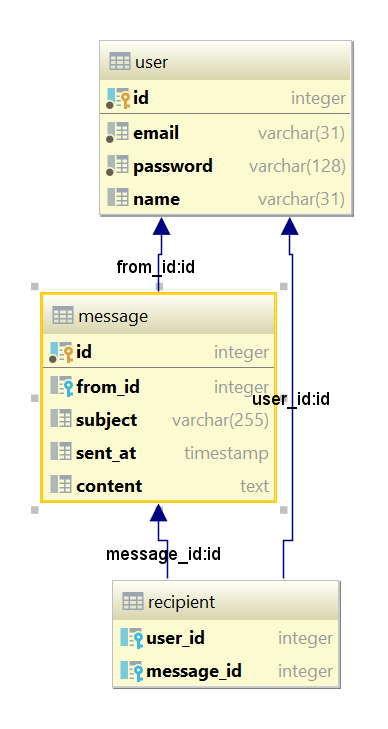

# hibernate-example

## What you should pay attention to

1. hibernate configuration - [hibernate.cfg.xml](src/main/resources/hibernate.cfg.xml)

2. check out db diagram -

3. annotations in models classes - [models](src/main/java/com/example/app/models)

3. hibernate usage - [Main.java](src/main/java/com/example/app/Main.java)
